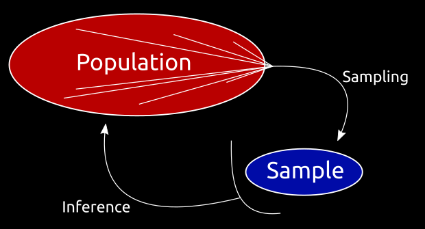
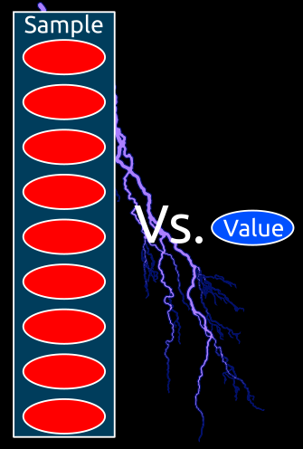

## Hypothesis tests

---

### Main questions

 
 
 

* What are they?
* Why are the necessary? <!-- .element: class="fragment" data-fragment-index="2" -->
* When can they be performed? <!-- .element: class="fragment" data-fragment-index="3" -->

---

### What are hypothesis tests?

* Remember H0 and H1?
* Methods of statistical inference <!-- .element: class="fragment" data-fragment-index="1" -->
* Confirmatory data analysis <!-- .element: class="fragment" data-fragment-index="2" -->
* Used to compare two or more datasets <!-- .element: class="fragment" data-fragment-index="3" -->
	* Sampled <!-- .element: class="fragment" data-fragment-index="4" -->
	* Modeled <!-- .element: class="fragment" data-fragment-index="5" -->

 

The comparison is considered **significant** if the relationship between the tested datasets is unlikely to be a chance realization of H0 according to a **pre-determined** threshold. <!-- .element: class="fragment" data-fragment-index="6" -->

---

### Why are they necessary?

When the goal is to make inferences regarding the population, based on a sample. <!-- .element: class="fragment" data-fragment-index="1" -->

---

### When can they be performed?

* Variable distribution is **known**: Parametric tests
* Variable distribution is **unknown**: Non-parametric tests

|||

### Assumptions

* Parametric tests require the data to conform to some parameters
	* These vary from test to test <!-- .element: class="fragment" data-fragment-index="1" -->
* Non-parametric tests also have assumptions: <!-- .element: class="fragment" data-fragment-index="2" -->
	* They assume the variables' distributions are similar <!-- .element: class="fragment" data-fragment-index="3" -->

 

Parametric tests usually have more statistical power than their non-parametric counterparts. <!-- .element: class="fragment" data-fragment-index="4" -->

---

## "Simple" tests

---

### Single sample

* Single sample tests are used when we want to compare a sample against a single value:
	* "Is this sample's value significantly different from a specific value?" <!-- .element: class="fragment" data-fragment-index="1" -->

 <!-- .element: class="fragment" data-fragment-index="2" -->

The *t-test*
 <!-- .element: class="fragment" data-fragment-index="3" -->
