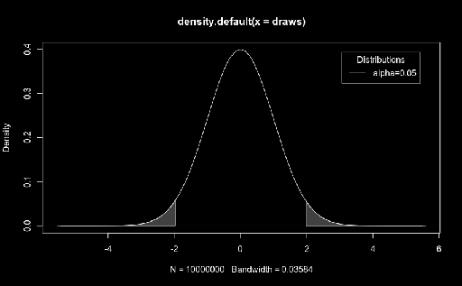

## Hypothesis tests

---

### Main questions

</br>
</br>
</br>

* What are they?
* Why are the necessary? <!-- .element: class="fragment" data-fragment-index="2" -->
* When can they be performed? <!-- .element: class="fragment" data-fragment-index="3" -->

---

### What are hypothesis tests?

* Remember H<sub>0</sub> and H<sub>1</sub>?
* Methods of statistical inference <!-- .element: class="fragment" data-fragment-index="1" -->
* Confirmatory data analysis <!-- .element: class="fragment" data-fragment-index="2" -->
* Used to compare two or more datasets <!-- .element: class="fragment" data-fragment-index="3" -->
	* Sampled <!-- .element: class="fragment" data-fragment-index="4" -->
	* Modeled <!-- .element: class="fragment" data-fragment-index="5" -->

</br>

<font color="red">The comparison is considered **significant** if the relationship between the tested datasets is unlikely to be a chance realization of H<sub>0</sub> according to a **pre-determined** threshold.</font> <!-- .element: class="fragment" data-fragment-index="6" -->

---

### Why are they necessary?


When the goal is to make inferences regarding the population, based on a sample. <!-- .element: class="fragment" data-fragment-index="1" -->

---

### When can they be performed?

* Variable distribution is **known**: <span class="fragment highlight-green">Parametric tests</span>
* Variable distribution is **unknown**: <span class="fragment highlight-red">Non-parametric tests</span>

|||

### Assumptions

* Parametric tests require the data to conform to some parameters
	* These vary from test to test <!-- .element: class="fragment" data-fragment-index="1" -->
* Non-parametric tests also have assumptions: <!-- .element: class="fragment" data-fragment-index="2" -->
	* They assume the variables' distributions are similar <!-- .element: class="fragment" data-fragment-index="3" -->

</br>

<font color="red">Parametric tests usually have more statistical power than their non-parametric counterparts.</font> <!-- .element: class="fragment" data-fragment-index="4" -->

---

## "Simple" tests

---

### Student's *t-test*

The *t-test* can be used to:
* Compare a sample with a value <!-- .element: class="fragment" data-fragment-index="1" -->
* Compare two independent samples <!-- .element: class="fragment" data-fragment-index="2" -->
* Compare two dependent samples <!-- .element: class="fragment" data-fragment-index="3" -->

 <!-- .element: class="fragment" data-fragment-index="4" -->

|||

### Student's *t-test*

```R
x <- seq(-4, 4, length=100)
hx <- dnorm(x)

degf <- c(1, 3, 8, 30)
colors <- c("red", "blue", "darkgreen", "gold", "black")
labels <- c("df=1", "df=3", "df=8", "df=30", "normal")

plot(x, hx, type="l", lty=2, xlab="x value",
     ylab="Density", main="Comparison of t Distributions")

for (i in 1:4){
    lines(x, dt(x,degf[i]), lwd=2, col=colors[i])
}

legend("topright", inset=.05, title="Distributions",
       labels, lwd=2, lty=c(1, 1, 1, 1, 2), col=colors)

```

|||

### Student's *t-test*

* A *t-value* is obtained by comparing the two datasets
* This value is compared to the tails of the distribution



---

### Single sample *t-test*

* Single sample tests are used when we want to compare a sample against a single value:
	* "Is this sample's value significantly different from a specific value?" <!-- .element: class="fragment" data-fragment-index="1" -->
<center></center> <!-- .element: class="fragment" data-fragment-index="2" -->

---

### Single sample *t-test* example

Is the pH value of water samples significantly different from "neutral" (pH=7)?

What about the "reference value for rivers" (pH=7.7)? <!-- .element: class="fragment" data-fragment-index="1" -->

Let's consider: <!-- .element: class="fragment" data-fragment-index="2" -->
* Data from "Dados_diatoms_heavymetals.csv" <!-- .element: class="fragment" data-fragment-index="3" -->
* Two tailed test <!-- .element: class="fragment" data-fragment-index="4" -->
* Alpha=0.05 <!-- .element: class="fragment" data-fragment-index="5" -->

|||

### Single sample *t-test* example

```R
diatoms = read.csv("/path/to/Dados_diatoms_heavymetals.csv")
ph = diatoms$pH

t.test(ph, mu=7, conf.level=0.95)
t.test(ph, mu=7.7, conf.level=0.95)
```

