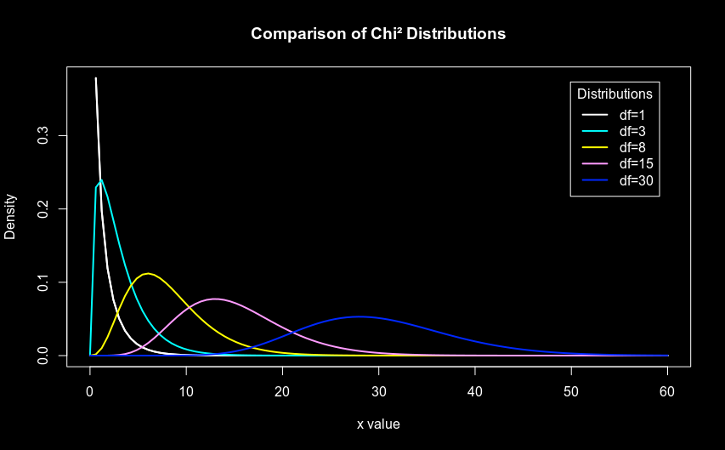
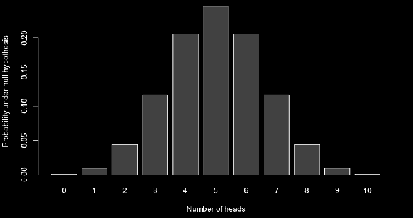

## Hypotheses tests II

---

### Multi category testing

* When it is necessary to compare observation counts to a theoretical expectation
* Examples: <!-- .element: class="fragment" data-fragment-index="1" -->
	* Is our sample of male and female individuals representative of the population's sex ratio? <!-- .element: class="fragment" data-fragment-index="1" -->
	* Are our counts of crossed flower colours matched to the expected Mendelian inheritance? <!-- .element: class="fragment" data-fragment-index="2" -->

---

### ["High Hopes"](https://www.youtube.com/watch?v=7jMlFXouPk8)

* There are several way to test the conformance to expectations
	* (Pearson's) Chi² test <!-- .element: class="fragment highlight-green" data-fragment-index="1" -->
	* G-test <!-- .element: class="fragment fade-out" data-fragment-index="1" -->
	* Exact test <!-- .element: class="fragment highlight-green" data-fragment-index="1" -->

---

### Chi² test

* Requires a "large" sample size
* Is computationally simple <!-- .element: class="fragment" data-fragment-index="1" -->
* Uses the "chi-square" distribution <!-- .element: class="fragment" data-fragment-index="2" -->

 <!-- .element: class="fragment" data-fragment-index="3" -->

|||

### Chi² distribution plots

```R
x <- seq(0, 60, length=100)
hx <- dchisq(x, df=1)

degf <- c(1, 3, 8, 15, 30)
colors <- c("black", "red", "blue", "darkgreen", "gold")
labels <- c("df=1", "df=3", "df=8", "df=15", "df=30")

plot(x, hx, type="l", lwd=2, xlab="x value",
     ylab="Density", main="Comparison of Chi² Distributions")

     for (i in 1:5){
         lines(x, dchisq(x,degf[i]), lwd=2, col=colors[i])
	 }

	 legend("topright", inset=.05, title="Distributions",
	        labels, lwd=2, col=colors)
```

---

### Example

* Consider the sex ratio of grasshoppers *Dichroplus maculipennis* (Blanchard)
	* 6038 individuals were collected and sexed <!-- .element: class="fragment" data-fragment-index="1" -->
	* 2235 females and 2301 males <!-- .element: class="fragment" data-fragment-index="2" -->
	* The expected proportion of female:male ratio is 1:1 <!-- .element: class="fragment" data-fragment-index="3" -->

[Reference](http://www.sciencedirect.com/science/article/pii/S0085562615000321) <!-- .element: class="fragment" data-fragment-index="4" -->

|||

### Example

```R
obs = c(2235, 2301)
exp = c(0.5, 0.5)

chisq.test(x=obs, p=exp)
```

---

### Multiple testing

* When there are more than 2 categories
	* Each category can be tested against the sum of all other categories <!-- .element: class="fragment" data-fragment-index="1" -->
	* FDR or Bonferroni corrections must be applied <!-- .element: class="fragment" data-fragment-index="2" -->

|||

### Multiple testing example

* Suppose we have flowers where allele determine colour <font color="red">AA</font>, <font color="pink">Aa</font>, <font color="white">aa</font>.
	* F1 contains <font color="red">1300</font>, <font color="pink">3000</font>, <font color="white">1500</font>
	* This trait has Mendelian inheritance <!-- .element: class="fragment" data-fragment-index="1" -->
	* All F0 males are white <!-- .element: class="fragment" data-fragment-index="2" -->
	* All F0 females are red <!-- .element: class="fragment" data-fragment-index="3" -->

Are these proportions according to the expectation of 1:2:1 ? <!-- .element: class="fragment" data-fragment-index="4" -->

|||

```R
p_vals = c()

obs = c(1300, 3000, 1500)
exp = c(0.25, 0.5, 0.25)

chisq.test(x=obs, p=exp)

for (i in 1:length(obs)) {
    partial_obs = c(obs[i], sum(obs[-i]))
        partial_exp = c(exp[i], sum(exp[-i]))
	    part_chisq = chisq.test(x=partial_obs, p=partial_exp)

	        p_vals[i] = part_chisq$p.value
		}

		print(p_vals)
		p.adjust(p_vals, method="fdr")
```

---

### What about 'small' samples?

* When the sample size is small, the Chi² test can be inaccurate
* In these cases an exact test should be employed <!-- .element: class="fragment" data-fragment-index="1" -->
	* Can be used with small samples <!-- .element: class="fragment" data-fragment-index="2" -->
	* Is computationally intensive <!-- .element: class="fragment" data-fragment-index="3" -->
	* Also called a "binomial" or "multinomial" test <!-- .element: class="fragment" data-fragment-index="4" -->

 <!-- .element: class="fragment" data-fragment-index="5" -->

|||

### Let's try another example

```R
obs = c(3, 11)
exp = c(0.5, 0.5)

chisq.test(x=obs, p=exp)

binom.test(x=obs[1], n=sum(obs), p=exp[1], conf.level=0.95)
```

|||

### Multinomial example

```R
if(!require("XNomial")){
    install.packages("XNomial")
        library("XNomial")
	}

	obs = c(4, 27, 12)
	exp = c(0.25, 0.5, 0.25)

	chisq.test(x=obs, p=exp)

	xmulti(obs=obs, expr=exp)

```

---

### Multidimensional contingency tables

* Tables in a matrix format
* Each entry represents a variable frequency distribution <!-- .element: class="fragment" data-fragment-index="1" -->
* Used to test whether the proportions of one variable are different for different values of the other variable <!-- .element: class="fragment" data-fragment-index="3" -->
* Examples: <!-- .element: class="fragment" data-fragment-index="4" -->
	* Are the class' grades different between male and female students? <!-- .element: class="fragment" data-fragment-index="4" -->
	* Are the side effects of a new drug more prone to occur if it is taken at night or in the morning? <!-- .element: class="fragment" data-fragment-index="5" -->

---

### Chi² test of independence

* Requires a "large" sample size
* Is computationally simple <!-- .element: class="fragment" data-fragment-index="1" -->
* Uses the "chi-square" distribution <!-- .element: class="fragment" data-fragment-index="2" -->

 <!-- .element: class="fragment" data-fragment-index="3" -->

|||

### Chi² test of independence example

* Suppose the following situation:
	* A new drug for migraines is being tested
	* It has some (uncommon) side effects <!-- .element: class="fragment" data-fragment-index="1" -->
	* We want to know if the side effects occur more often when the drug is taken at night or in the morning <!-- .element: class="fragment" data-fragment-index="2" -->
	* Of the 4682 cases where the drug was taken at night, 30 reported side effects <!-- .element: class="fragment" data-fragment-index="3" -->
	* Of the 8813 cases where it was taken in the morning, 76 reported side effects <!-- .element: class="fragment" data-fragment-index="4" -->

|||

### Chi² test of independence example

```R
R1 = c(4682, 30)
R2 = c(8813, 76)

side_effects_matrix = matrix(c(R1, R2),
                             nrow=2,
                             byrow=TRUE)

# Naming if not mandatory:
rownames(side_effects_matrix) = c("Night", "Morning")
colnames(side_effects_matrix) = c("No.side.effects",
                                  "Side.effects")


chisq.test(side_effects_matrix,
           correct=TRUE)
```

---

### What about 'small' samples?

* When the sample size is small, the Chi² test can be inaccurate
* In these cases an exact test should be employed <!-- .element: class="fragment" data-fragment-index="1" -->
	* Can be used with small samples <!-- .element: class="fragment" data-fragment-index="2" -->
	* Is computationally intensive <!-- .element: class="fragment" data-fragment-index="3" -->
	* Fischer's exact test of independence <!-- .element: class="fragment" data-fragment-index="4" -->

---

### Fisher's exact test

* Consider the following situation:
	* Plants in a garden are watered in different intervals
	* Daily, Weekly, Monthly and Quarterly <!-- .element: class="fragment" data-fragment-index="1" -->
	* After a year, the plants' survival rate is measured <!-- .element: class="fragment" data-fragment-index="2" -->
	* Does the watering frequency make a difference for these plants?  <!-- .element: class="fragment" data-fragment-index="3" -->

<table>
<tr><td>Frequency</td><td>Dead</td><td>Alive</td></tr>
<tr><td>Daily</td><td>1</td><td>24</td></tr>
<tr><td>Weekly</td><td>5</td><td>20</td></tr>
<tr><td>Monthly</td><td>14</td><td>11</td></tr>
<tr><td>Quarterly</td><td>11</td><td>14</td></tr>
<tr><td></td></tr>
</table> <!-- .element: class="fragment" data-fragment-index="4" -->

|||


### Fisher's exact test

```R
text_input =("
Frequency  Dead  Alive
Daily       1        24
Weekly      5        20
Monthly    14        11
Quarterly  11        14
")

small_samples_matrix = as.matrix(read.table(textConnection(text_input),
                                 header=TRUE,
                                 row.names=1))

fisher.test(small_samples_matrix,
            alternative="two.sided")
```

---

### Regression Analysis


