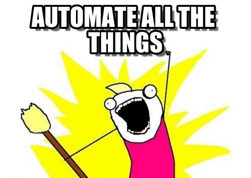

## Automation & Reproducibility

Automation <!-- .element: class="fragment" data-fragment-index="1" -->

---

### Main questions

* What is it?
* When is it useful? <!-- .element: class="fragment" data-fragment-index="1" -->
* How does it 'work'? <!-- .element: class="fragment" data-fragment-index="2" -->

---

### What is automation?

* Performing tasks without human intervention

 <!-- .element: class="fragment" data-fragment-index="1" -->

---

### When is automation useful?

* For repetitive tasks
* For complex tasks <!-- .element: class="fragment" data-fragment-index="1" -->
* For long tasks <!-- .element: class="fragment" data-fragment-index="2" -->
* For repetitive, long, complex, tasks <!-- .element: class="fragment" data-fragment-index="3" -->

|||

### Consequences of automation

* Reduces random error
	* At the cost of increased systematic error <!-- .element: class="fragment" data-fragment-index="1" -->
* Reduces intervention times <!-- .element: class="fragment" data-fragment-index="2" -->
	* At the cost of a longer development process <!-- .element: class="fragment" data-fragment-index="3" -->
* Helps focus on main goals <!-- .element: class="fragment" data-fragment-index="4" -->
	* At the cost of reduced flexibility <!-- .element: class="fragment" data-fragment-index="5" -->

---

### How does automation work?

* A task is considered "automated" when it does not require human intervention
* For this, several things are important: <!-- .element: class="fragment" data-fragment-index="1" -->
	* Repeating a task with slightly different parameters <!-- .element: class="fragment" data-fragment-index="2" -->
		* "for loop" <!-- .element: class="fragment" data-fragment-index="3" -->
	* Making decisions based on defined criteria <!-- .element: class="fragment" data-fragment-index="4" -->
		* "if - else" clauses <!-- .element: class="fragment" data-fragment-index="5" -->
* Flexibility must be built-in <!-- .element: class="fragment" data-fragment-index="6" -->

|||

### Speaking of which...

If - else clause in "pseudocode"

```
if (condition to assess) {
    do something
} else {
    do something else
}
```

|||

### Speaking of which...

If - else clause in R

```R
x = 3

if (x < 4) {
    x = x * x
} else {
    x = x + x
}
```

|||

### Speaking of which...

We can do better, though

```R
x = 3

if (x < 4) {
    x = x * x
} else if (x == 4) {
    x = 4
} else {
    x = x + x
}
```

---

### If only we knew a way to improve the way we test this code...

---

### How about a function?

```R
magic_4 = function(x) {
    if (x < 4) {
        x = x * x
    } else if (x == 4) {
        x = 4
    } else {
        x = x + x
    }
    return(x)
}

magic_4(3)
magic_4(4)
magic_4(5)
```

|||

### Are we sure this is looking good?

```R
for (i in c(3:5)){
    print(magic_4(i))
}
```

---

## AUTOMATION!

---

## Reproducibility

---

### Main questions

* What is it?
* When is it useful? <!-- .element: class="fragment" data-fragment-index="1" -->
* How to improve a work's reproducibility? <!-- .element: class="fragment" data-fragment-index="2" -->

---

### What is reproducibility?

* Re-doing something and obtaining the same result
* Central to science in general <!-- .element: class="fragment" data-fragment-index="1" -->
* Especially relevant in computational analyses <!-- .element: class="fragment" data-fragment-index="2" -->
	* Easy to re-run (including by other people) <!-- .element: class="fragment" data-fragment-index="3" -->
	* Cheap to re-run (unlike wet-lab experiments) <!-- .element: class="fragment" data-fragment-index="4" -->

---

### When is reproducibility useful?

* Making sure a procedure is (technically) correct
* Sharing analyses with other researchers <!-- .element: class="fragment" data-fragment-index="1" -->
* Validating studies <!-- .element: class="fragment" data-fragment-index="2" -->

---

### How to improve the reproducibility value of a work?

* Keep track of program versions
	* Control the environment <!-- .element: class="fragment" data-fragment-index="1" -->
* Use a Version Control System (VCS) <!-- .element: class="fragment" data-fragment-index="2" -->
	* Version control code, parameters and results <!-- .element: class="fragment" data-fragment-index="3" -->
* Use automated code! <!-- .element: class="fragment" data-fragment-index="4" -->
* Make the data available  <!-- .element: class="fragment" data-fragment-index="5" -->

[Now is a good chance to show github](https://github.com/StuntsPT/BP2017) <!-- .element: class="fragment" data-fragment-index="6" -->

---

## Some practical examples

---

### Say "no" to "hard coding" things

```R
obs = c(5, 32)
exp = c(9/10, 1/10)
```

Vs.

```R
obs = table(war_data$attacker_outcome)
exp = c(9/10, 1/10)
```

---

### Do not rely on "autoprints"

```R
shapiro.test(some_distribution)
```

Vs.

```R
print(shapiro.test(some_distribution))
```

---

### Filter your outputs

```R
print(shapiro.test(some_distribution))
```

Vs.

```R
print(shapiro.test(some_distribution)$p.value)
```

---

### Write readable code

Especially at this early stage!

```R
plot(hclust(dist(plantTraits)))
```

Vs.

```R
dist_matrix = dist(plantTraits)
cluster = hclust(dist_matrix)

plot(cluster)

```
